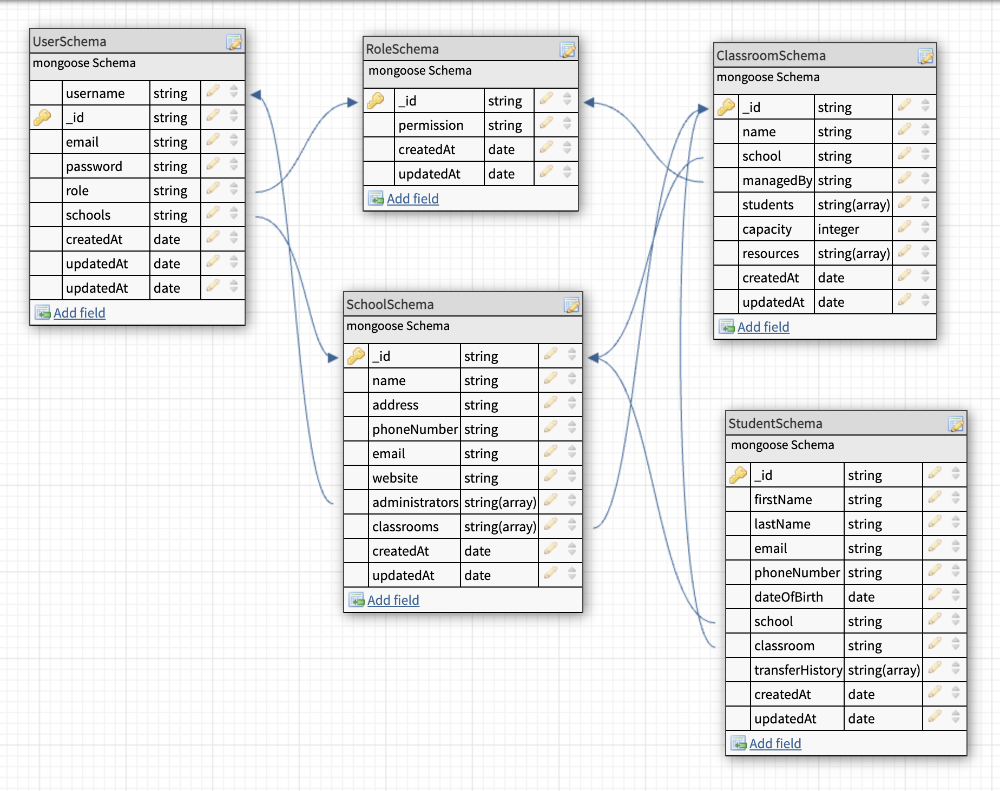

# School Management System API

This project is a backend API for a School Management System (SMS). It includes features such as administrator, schools, and classrooms management, as well as students enrollment.

## How to Use the API

### Setup

- Configure environment variables in the `.env` file:

  ```env
  SERVICE_NAME=your-service-name
  ENV=your-env
  CORTEX_REDIS=your-redis-cortex-url
  CORTEX_PREFIX=your-cortex-prefix
  CORTEX_TYPE=your-cortex-type
  REDIS_URI=your-redis-uri
  OYSTER_REDIS=your-oyster-redis-url
  OYSTER_PREFIX=your-oyster-redis-prefix
  CACHE_REDIS=your-redis-cache-url
  CACHE_PREFIX=your-redis-cache-prefix
  MONGO_URI=your-mongo-uri
  USER_PORT=user-port
  ADMIN_PORT=admin-port
  ADMIN_URL=admin-url
  LONG_TOKEN_SECRET=your-long-token
  SHORT_TOKEN_SECRET=your-short-token
  NACL_SECRET=your-nacl-secret
  ```

- **Installation**

```bash
npm install
```

- **Development Mode:**

```bash
npm run dev
```

- **Production Mode:**

```bash
npm run start
```

- **Unit Test:**

```bash
npm run test
```

### Docker:

- **Build the image:**

```bash
npm run docker:build
```

- **Run the container:**

```bash
npm run docker:run
```

- Note: If you have issues with running `npm run docker:run`, run the script `npm run remove:module` to remove the node_modules folder and package lock file. Then run `npm run docker:build` to build docker again.

### Deployment

- **Deploy to Google Cloud Run**

- Install Google Cloud CLI
- Login and authenticate your user account
- Create a project on Google Cloud
- configure the `cloudbuild.yaml` file to match your credentials (Google Cloud project ID).
- Run `npm run gcp:docker:build` to build the docker file on Cloud Run
- Goto Cloud Run:
- 1. Click `Deploy Container` and select `Service`
- 2. Select `Deploy one revision from an existing container image`
- 3. Select the container image URL that you built previously
- 4. Select and fill the necessary options and click on `Create` to deploy your service.

### Testing the API

Use tools like Postman or Curl to test the API. Ensure to include authentication tokens and necessary parameters in the requests.

## User Management API Documentation

This API provides functionalities for managing users, including creating, updating, retrieving, and deleting user profiles. It uses an Express.js framework and integrates with a `UserManager` service for the business logic.

## API Endpoints

- BASE_URL= https://your-enpoint-url

### 1. **Create Superadmin**

#### Endpoint

`POST api/v1/user/superadmin`

#### Description

Creates a new superadmin user. This is the first point of contact before you will be able to perform other actions needed. This is a low-level endpoint that should never be exposed to users.

#### Middleware

- `validateRequest`: Ensures required fields are present.

#### Request Parameters

```plaintext
| Parameter  | Type   | Required | Description                 |
| ---------- | ------ | -------- | --------------------------- |
| `username` | String | Yes      | Username for the superadmin |
| `email`    | String | Yes      | Email address               |
| `password` | String | Yes      | Password for the superadmin |
```

#### Response

- **Success (201)**: `{ success: true, message: '...', data: {...} }`
- **Failure (400)**: `{ success: false, errors: [...] }`

## Example Request

#### Create Superadmin

```bash
curl -X POST \
  -H "Content-Type: application/json" \
  -d '{
    "username": "john_doe",
    "email": "john@example.com",
    "password": "@1Secure$Pass",
  }' \
  BASE_URL/api/v1/user/superadmin
```

### Response

```json
{
  "success": true,
  "message": "User created successfully.",
  "data": {...}
}
```

### 2. **Create User**

#### Endpoint

`POST api/v1/user/create-user`

#### Description

Creates a new user.

#### Middleware

- `validateRequest`: Ensures required fields are present.
- `authMiddleware`: Verifies authentication token.
- `roleMiddleware`: Restricts access to `superadmin` roles.

- Note: You have to create a `schooladmin` role first before you can create a school administrator user. See the Role Management API documentation below.

#### Request Parameters

```plaintext
| Parameter  | Type   | Required | Description               |
| ---------- | ------ | -------- | ------------------------- |
| `username` | String | Yes      | Username for the new user |
| `email`    | String | Yes      | Email address             |
| `password` | String | Yes      | Password for the user     |
| `role`     | String | Yes      | Role ID of the user       |
```

#### Response

- **Success (201)**: `{ success: true, message: '...', data: {...} }`
- **Failure (400)**: `{ success: false, errors: [...] }`

### Example Request

#### Create User

```bash
curl -X POST \
  -H "Content-Type: application/json" \
  -H "Authorization: Bearer <token>" \
  -d '{
    "username": "john_doe",
    "email": "john@example.com",
    "password": "@1Secure&Pass",
    "role": "677233dadc2120d98cc9d557",
  }'\
  BASE_URL/api/v1/user/create-user
```

### Response

```json
{
  "success": true,
  "message": "User created successfully.",
  "data": {...}
}
```

### 3. **Get Users**

#### Endpoint

`GET api/v1/user/users`

#### Description

Fetches a paginated list of users.

#### Middleware

- `authMiddleware`: Verifies authentication token.
- `roleMiddleware`: Restricts access to `superadmin` roles.

#### Query Parameters

```plaintext
| Parameter | Type    | Required | Description                                       |
| --------- | ------- | -------- | ------------------------------------------------- |
| `page`    | Integer | No       | Page number for pagination, default to 1          |
| `limit`   | Integer | No       | Number of users to return per page, default to 10 |
```

#### Response

- **Success (201)**: `{ success: true, message: '...', users: [...] }`
- **Failure (400)**: `{ success: false, errors: [...] }`

### Example Request

#### Get Users

```bash
curl -X GET \
  -H "Content-Type: application/json" \
  -H "Authorization: Bearer <token>" \
  BASE_URL/api/v1/user/users?page=1&limit=10
```

### Response

```json
{
  "success": true,
  "message": "Users fetched successfully.",
  "data": [...],
  "pagination": {
    "currentPage": 1,
    "totalPages": 1,
    "totalUsers": 2
  }
}
```

### 4. **Get User by ID**

#### Endpoint

`GET api/v1/user?userId=67727ae...`

#### Description

Fetches user details by ID.

#### Middleware

- `authMiddleware`: Verifies authentication token.
- `roleMiddleware`: Restricts access to `superadmin` and `schooladmin` roles.
- `queryMiddleware`: Validates required query parameters.

#### Query Parameters

```plaintext
| Parameter | Type   | Required | Description             |
| --------- | ------ | -------- | ----------------------- |
| `userId`  | String | Yes      | ID of the user to fetch |
```

#### Response

- **Success (201)**: `{ success: true, message: '...', user: {...} }`
- **Failure (400)**: `{ success: false, errors: [...] }`

### Example Request

#### Get User

```bash
curl -X GET \
  -H "Content-Type: application/json" \
  -H "Authorization: Bearer <token>" \
  BASE_URL/api/v1/user?userId=67727ae...
```

### Response

```json
{
  "success": true,
  "message": "User fetched successfully.",
  "data": {...}
}
```

### 5. **Update User Profile**

#### Endpoint

`PUT api/v1/user?userId=67727ae...`

#### Description

Updates a user profile.

#### Middleware

- `validateRequest`: Ensures required fields are present.
- `authMiddleware`: Verifies authentication token.
- `roleMiddleware`: Restricts access to `superadmin` and `schooladmin` roles.
- `queryMiddleware`: Validates required query parameters.

#### Query Parameters

```plaintext
| Parameter | Type   | Required | Description              |
| --------- | ------ | -------- | ------------------------ |
| `userId`  | String | Yes      | ID of the user to update |
```

#### Request Body

```plaintext
| Parameter  | Type   | Required | Description             |
| ---------- | ------ | -------- | ----------------------- |
| `username` | String | Optional | Fields to be updated    |
| `emails`   | String | Optional | Fields to be updated    |
| `password` | String | Optional | Fields to be updated    |
| `role`     | String | Optional | Fields to be updated    |
| `schools`  | Object | Optional | School ID to be updated |
```

#### Response

- **Success (201)**: `{ success: true, message: '...', user: {...} }`
- **Failure (400)**: `{ success: false, errors: [...] }`

### Example Request

#### Update User Profile

```bash
curl -X PUT \
  -H "Content-Type: application/json" \
  -H "Authorization: Bearer <token>" \
  -d '{
    "role": "677233dadc2120d98cc9d557",
    "schools": {
      "add": ["677282c4fb756a7166f57390"],
      "remove": []
    }
  }' \
  BASE_URL/api/v1/user?userId=67727ae...
```

### Response

```json
{
  "success": true,
  "message": "User profile updated successfully."
}
```

### 6. **Delete User Profile**

#### Endpoint

`DELETE api/v1/user`

#### Description

Deletes a user profile.

#### Middleware

- `authMiddleware`: Verifies authentication token.
- `roleMiddleware`: Restricts access to `superadmin` roles.
- `queryMiddleware`: Validates required query parameters.

#### Query Parameters

```plaintext
| Parameter | Type   | Required | Description              |
| --------- | ------ | -------- | ------------------------ |
| `userId`  | String | Yes      | ID of the user to delete |
```

#### Response

- **Success (201)**: `{ success: true, message: "User deleted successfully" }`
- **Failure (400)**: `{ success: false, errors: [...] }`

### Example Request

#### Delete User Profile

```bash
curl -X DELETE \
  -H "Content-Type: application/json" \
  -H "Authorization: Bearer <token>" \
  BASE_URL/api/v1/user?userId=67727ae...
```

### Response

```json
{
  "success": true,
  "message": "User profile deleted successfully."
}
```

## Assumptions

- Authentication and authorization are handled via middleware (`authMiddleware`, `roleMiddleware`).
- `UserManager` is responsible for the business logic of user operations.
- Errors are returned in a consistent JSON format.

## Role Management API Endpoints

### 1. **Create Role**

#### Endpoint

`POST api/v1/role/create-role`

#### Description

Creates a new role with the specified permission.

#### Middleware

- `authMiddleware`: Verifies the authentication token.
- `roleMiddleware`: Restricts access to users with `superadmin` permissions.

#### Request Parameters

```plaintext
| Parameter    | Type                                | Required | Description                 |
| ------------ | ----------------------------------- | -------- | --------------------------- |
| `permission` | Enum: ['superadmin', 'schooladmin'] | Yes      | Name of the permission/role |
```

## Example Request

#### Create Role

```bash
curl -X POST \
  -H "Content-Type: application/json" \
  -H "Authorization: Bearer <token>" \
  -d '{
    "permission": "superadmin",
  }'\
  BASE_URL/api/v1/role/create-role
```

#### Response

- **Success (201)**:
  ```json
  {
    "success": true,
    "message": "superadmin role created successfully",
    "data": {...}
  }
  ```
- **Failure (400)**:
  ```json
  {
    "errors": "Role model is not loaded"
  }
  ```

### 2. **Get All Roles**

#### Endpoint

`GET api/v1/role/roles`

#### Description

Fetches all roles in the system.

#### Middleware

- `authMiddleware`: Verifies the authentication token.
- `roleMiddleware`: Restricts access to users with `superadmin` permissions.

## Example Request

#### Get All Roles

```bash
curl -X GET \
  -H "Content-Type: application/json" \
  -H "Authorization: Bearer <token>" \
  BASE_URL/api/v1/role/roles
```

#### Response

- **Success (201)**:
  ```json
  {
    "success": true,
    "message": "Roles fetched successfully",
    "data": [...]
  }
  ```
- **Failure (400)**:
  ```json
  {
    "errors": "Role not found"
  }
  ```

### 3. **Get Role by ID**

#### Endpoint

`GET api/v1/role`

#### Description

Fetches a role by its ID.

#### Middleware

- `authMiddleware`: Verifies the authentication token.
- `queryMiddleware`: Ensures `roleId` query parameter is provided.
- `roleMiddleware`: Restricts access to users with `superadmin` permissions.

#### Query Parameters

```plaintext
| Parameter | Type   | Required | Description                  |
| --------- | ------ | -------- | ---------------------------- |
| `roleId`  | String | Yes      | ID of the role to be fetched |
```

#### Get Role by ID

## Example Request

```bash
curl -X GET \
  -H "Content-Type: application/json" \
  -H "Authorization: Bearer <token>" \
  BASE_URL/api/v1/role?roleId=12345
```

#### Response

- **Success (201)**:
  ```json
  {
    "success": true,
    "message": "Role fetched successfully",
    "data": {...}
  ```
- **Failure (400)**:
  ```json
  {
    "errors": "Role not found"
  }
  ```

## Assumptions

1. **Role Permissions**:

   - Only users with `superadmin` permissions can access or modify role-related resources.

2. **Middleware Validation**:

   - Authentication and role-based access control are implemented via `authMiddleware` and `roleMiddleware`.

3. **Database Models**:
   - MongoDB models for roles are properly configured and loaded.

## Auth API Endpoints

### 1. **Login**

#### Endpoint

`POST api/v1/auth/login`

#### Description

Authenticates a user by validating credentials and generates tokens for subsequent requests.

#### Middleware

- `validateRequest`: Ensures required fields (`identifier`, `password`) are present.
- `deviceMiddleware`: Captures device-specific information for token generation.

#### Request Parameters

```plaintext
| Parameter    | Type   | Required | Description                         |
| ------------ | ------ | -------- | ----------------------------------- |
| `identifier` | String | Yes      | Email or username of the user       |
| `password`   | String | Yes      | User's password                     |
```

## Example Request

#### Login

```bash
curl -X POST \
  -H "Content-Type: application/json" \
  -d '{
    "identifier": "john_doe",
    "password": "@1Secure$Pass",
  }' \
  BASE_URL/api/v1/auth/login
```

#### Response

- **Success (201)**:
  ```json
  {
    "success": true,
    "message": "Logged in successfully.",
    "data": {...},
    "token": "eyJhbGciOiJIUzI1NiIsInR5cCI6IkpXVCJ9...."
  }
  ```
- **Failure (401)**:
  ```json
  {
    "errors": "Invalid email or password."
  }
  ```

### 2. **Logout**

#### Endpoint

`PUT api/v1/auth/logout`

#### Description

Logs out a user by blacklisting the provided token.

#### Middleware

- `queryMiddleware`: Validates the presence of the `token` query parameter.

#### Query Parameters

```plaintext
| Parameter | Type   | Required | Description                 |
| --------- | ------ | -------- | --------------------------- |
| `token`   | String | Yes      | The token to be invalidated |
```

### Example Request

#### Logout

```bash
curl -X PUT \
  -H "Content-Type: application/json" \
  BASE_URL/api/v1/auth/logout?token=eyJhbGciOiJIUzI1NiIsInR5cCI6IkpXVCJ9...
```

#### Response

- **Success (201)**:
  ```json
  {
    "success": true,
    "message": "Logged out successfully."
  }
  ```
- **Failure (401)**:
  ```json
  {
    "errors": "Invalid token"
  }
  ```

## Assumptions

1. **Token Management**:

   - Long and short tokens are generated for authentication purposes.
   - Blacklisting tokens ensures secure logout.

2. **Role Permissions**:

   - User roles are validated to assign specific permissions.

3. **Middleware**:

   - Middleware ensures proper validation and device information capture during authentication.

4. `AuthManager` is responsible for the business logic of auth operations.

# School Management API

## Overview

This API provides functionalities to manage school entities, including creation, retrieval, updating, and deletion of schools. It ensures secure operations through authentication and role-based permissions.

## API Endpoints

### 1. **Create School**

#### Endpoint

`POST api/v1/school/create-school`

#### Description

Creates a new school with the specified details.

#### Middleware

- `validateRequest`: Validates required fields in the request body.
- `authMiddleware`: Verifies the authentication token.
- `roleMiddleware`: Restricts access to users with `superadmin` permissions.

#### Request Parameters

```plaintext
| Parameter        | Type   | Required | Description                 |
| ---------------- | ------ | -------- | --------------------------- |
| `name`           | String | Yes      | Name of the school          |
| `address`        | String | Yes      | Address of the school       |
| `phoneNumber`    | String | Yes      | Phone number of the school  |
| `email`          | String | Yes      | Email address of the school |
| `website`        | String | Yes      | Website URL of the school   |
| `administrators` | Array  | Yes      | List of administrator IDs   |
```

### Example Request

#### Create School

```bash
curl -X POST \
  -H "Content-Type: application/json" \
  -H "Authorization: Bearer <token>" \
  -d '{
    "name": "Test School",
    "address": "123 Main St",
    "phoneNumber": "123-456-7890",
    "email": "info@testschool.com",
    "website": "https://testschool.com",
    "administrators": ["6773877519866849845a7b3a", "67727ae18b905ee631f3a7db"]
  }' \
  BASE_URL/api/v1/school/create-school
```

#### Response

- **Success (201)**:
  ```json
  {
    "success": true,
    "message": "School created successfully.",
    "data": {...}
  }
  ```
- **Failure (400)**:
  ```json
  {
    "errors": "Validation error details"
  }
  ```

### 2. **Get All Schools**

#### Endpoint

`GET api/v1/school/schools`

#### Description

Fetches all schools associated with the authenticated administrator.

#### Middleware

- `authMiddleware`: Verifies the authentication token.
- `roleMiddleware`: Restricts access to `superadmin` and `schooladmin` roles.

#### Query Parameters

```plaintext
| Parameter | Type   | Required | Description                              |
| --------- | ------ | -------- | ---------------------------------------- |
| `page`    | Number | No       | Page number for pagination (default: 1)  |
| `limit`   | Number | No       | Number of records per page (default: 10) |
```

### Example Request

#### Get All Schools

```bash
curl -X GET \
  -H "Content-Type: application/json" \
  -H "Authorization: Bearer <token>" \
  "BASE_URL/api/v1/school/schools?page=1&limit=10"
```

#### Response

- **Success (201)**:
  ```json
  {
    "success": true,
    "message": "Schools fetched successfully.",
    "data": [...],
    "pagination": {
      "currentPage": 1,
      "totalPages": 1,
      "totalSchools": 1
    }
  }
  ```
- **Failure (400)**:
  ```json
  {
    "errors": "No school found for the given admin ID"
  }
  ```

### 3. **Get School by ID**

#### Endpoint

`GET api/v1/school`

#### Description

Fetches details of a school by its ID.

#### Middleware

- `authMiddleware`: Verifies the authentication token.
- `queryMiddleware`: Ensures `schoolId` is present in the query.
- `roleMiddleware`: Restricts access to `superadmin` and `schooladmin` roles.

#### Query Parameters

```plaintext
| Parameter  | Type   | Required | Description               |
| ---------- | ------ | -------- | ------------------------- |
| `schoolId` | String | Yes      | ID of the school to fetch |
```

### Example Request

#### Get School by ID

```bash
curl -X GET \
  -H "Content-Type: application/json" \
  -H "Authorization: Bearer <token>" \
  "BASE_URL/api/v1/school/?schoolId=12345"
```

#### Response

- **Success (201)**:
  ```json
  {
    "success": true,
    "message": "School fetched successfully.",
    "data": {... }
  }
  ```
- **Failure (400)**:
  ```json
  {
    "errors": "School not found or you do not have access to this school"
  }
  ```

### 4. **Update School**

#### Endpoint

`PUT api/v1/school`

#### Description

Updates details of a school.

#### Middleware

- `validateRequest`: Validates fields in the request body.
- `authMiddleware`: Verifies the authentication token.
- `queryMiddleware`: Ensures `schoolId` is present in the query.
- `roleMiddleware`: Restricts access to users with `superadmin` permissions.

#### Query Parameters

```plaintext
| Parameter  | Type   | Required | Description                |
| ---------- | ------ | -------- | -------------------------- |
| `schoolId` | String | Yes      | ID of the school to update |
```

#### Request Parameters

```plaintext
| Parameter        | Type   | Required | Description                                 |
| ---------------- | ------ | -------- | ------------------------------------------- |
| `name`           | String | No       | Updated name of the school                  |
| `address`        | String | No       | Updated address of the school               |
| `phoneNumber`    | String | No       | Updated phone number                        |
| `email`          | String | No       | Updated email address                       |
| `website`        | String | No       | Updated website URL                         |
| `administrators` | Object | No       | Object containing `add` and `remove` arrays |
```

### Example Request

#### Update School

```bash
curl -X PUT \
  -H "Content-Type: application/json" \
  -H "Authorization: Bearer <token>" \
  -d '{
    "name": "Updated School",
    "address": "456 Another St",
    "administrators": {
       "add": ["677282c4fb756a7166f57390"],
      "remove": ["677234c28b905ee631f3a7ca"]
    }
  }' \
  "BASE_URL/api/v1/school?schoolId=12345"
```

#### Response

- **Success (201)**:
  ```json
  {
    "success": true,
    "message": "School updated successfully.",
    "data": {...}
  }
  ```
- **Failure (400)**:
  ```json
  {
    "errors": "Unauthorized. You are not an authorized administrator of this school."
  }
  ```

### 5. **Delete School**

#### Endpoint

`DELETE api/v1/school`

#### Description

Deletes a school by its ID.

#### Middleware

- `authMiddleware`: Verifies the authentication token.
- `queryMiddleware`: Ensures `schoolId` is present in the query.
- `roleMiddleware`: Restricts access to users with `superadmin` permissions.

#### Query Parameters

```plaintext
| Parameter  | Type   | Required | Description                |
| ---------- | ------ | -------- | -------------------------- |
| `schoolId` | String | Yes      | ID of the school to delete |
```

### Example Request

#### Delete School

```bash
curl -X DELETE \
  -H "Content-Type: application/json" \
  -H "Authorization: Bearer <token>" \
  "BASE_URL/api/v1/school/?schoolId=12345"
```

#### Response

- **Success (201)**:
  ```json
  {
    "success": true,
    "message": "School deleted successfully."
  }
  ```
- **Failure (400)**:
  ```json
  {
    "errors": "Unauthorized. Only authorized administrators can delete this school."
  }
  ```

## Assumptions

1. **Role-Based Permissions**:
   - Only users with `superadmin` or `schooladmin` roles can perform actions.
2. **Middleware Validation**:
   - Middleware is implemented to ensure data validation, authentication, and role-based access.
3. **MongoDB Models**:
   - MongoDB models are correctly loaded and configured for school entities.

# Classroom Management API

## Overview

The Classroom Management API provides endpoints to manage classroom entities, including creating, retrieving, updating, and deleting classrooms. The API ensures secure operations through authentication and role-based permissions.

## API Endpoints

### 1. **Create Classroom**

#### Endpoint

`POST api/v1/classroom`

#### Description

Creates a new classroom under a specified school.

#### Middleware

- `validateRequest`: Validates required fields in the request body.
- `authMiddleware`: Verifies the authentication token.
- `roleMiddleware`: Restricts access to users with `superadmin` or `schooladmin` roles.
- `queryMiddleware`: Ensures `schoolId` is present in the query.

#### Request Parameters

```plaintext
| Parameter   | Type   | Required | Description                        |
| ----------- | ------ | -------- | ---------------------------------- |
| `name`      | String | Yes      | Name of the classroom              |
| `capacity`  | Number | Yes      | Maximum number of students         |
| `resources` | Array  | No       | List of resources in the classroom |
| `schoolId`  | String | Yes      | ID of the school                   |
```

### Example Request

#### Create Classroom

```bash
curl -X POST \
  -H "Content-Type: application/json" \
  -H "Authorization: Bearer <token>" \
  -d '{
    "name": "Class Ball",
    "capacity": 30,
    "resources": ["Projector", "Whiteboard"]
  }' \
  "BASE_URL/api/v1/classroom?schoolId=12345"
```

#### Response

- **Success (201)**:
  ```json
  {
    "success": true,
    "message": "Classroom created successfully.",
    "data": {...}
  }
  ```
- **Failure (400)**:
  ```json
  {
    "errors": "Validation error details"
  }
  ```

### 2. **Get Classrooms**

#### Endpoint

`GET api/v1/classroom/classrooms`

#### Description

Fetches all classrooms under a specified school.

#### Middleware

- `authMiddleware`: Verifies the authentication token.
- `roleMiddleware`: Restricts access to users with `superadmin` or `schooladmin` roles.
- `queryMiddleware`: Ensures `schoolId` is present in the query.

#### Query Parameters

```plaintext
| Parameter  | Type   | Required | Description                              |
| ---------- | ------ | -------- | ---------------------------------------- |
| `schoolId` | String | Yes      | ID of the school                         |
| `page`     | Number | No       | Page number for pagination (default: 1)  |
| `limit`    | Number | No       | Number of records per page (default: 10) |
```

### Example Request

#### Get Classrooms

```bash
curl -X GET \
  -H "Content-Type: application/json" \
  -H "Authorization: Bearer <token>" \
  "BASE_URL/api/v1/classroom/classrooms?schoolId=12345&page=1&limit=10"
```

#### Response

- **Success (201)**:

  ```json
  {
    "success": true,
    "message": "Classrooms fetched successfully.",
    "data": [...],
    "pagination": {
      "currentPage": 1,
      "totalPages": 1,
      "totalClassrooms": 1
    }
  }
  ```

- **Failure (400)**:
  ```json
  {
    "errors": "No classrooms found for the given school ID"
  }
  ```

### 3. **Get Classroom by ID**

#### Endpoint

`GET api/v1/classroom`

#### Description

Fetches details of a specific classroom by its ID.

#### Middleware

- `authMiddleware`: Verifies the authentication token.
- `queryMiddleware`: Ensures `classroomId` is present in the query.
- `roleMiddleware`: Restricts access to users with `superadmin` or `schooladmin` roles.

#### Query Parameters

```plaintext
| Parameter     | Type   | Required | Description         |
| ------------- | ------ | -------- | ------------------- |
| `classroomId` | String | Yes      | ID of the classroom |
```

### Example Request

#### Get Classroom by ID

```bash
curl -X GET \
  -H "Content-Type: application/json" \
  -H "Authorization: Bearer <token>" \
  "BASE_URL/api/v1/classroom?classroomId=6773129eea8a46e709a85b30"
```

#### Response

- **Success (201)**:

  ```json
  {
    "success": true,
    "message": "Classroom fetched successfully.",
    "data": {...}
  }
  ```

- **Failure (400)**:
  ```json
  {
    "errors": "Classroom not found or you do not have access to this classroom"
  }
  ```

### 4. **Update Classroom**

#### Endpoint

`PUT api/v1/classroom`

#### Description

Updates details of a classroom.

#### Middleware

- `validateRequest`: Validates fields in the request body.
- `authMiddleware`: Verifies the authentication token.
- `queryMiddleware`: Ensures `classroomId` is present in the query.
- `roleMiddleware`: Restricts access to users with `superadmin` or `schooladmin` roles.

#### Query Parameters

```plaintext
| Parameter     | Type   | Required | Description                   |
| ------------- | ------ | -------- | ----------------------------- |
| `classroomId` | String | Yes      | ID of the classroom to update |
```

#### Request Parameters

```plaintext
| Parameter   | Type   | Required | Description                          |
| ----------- | ------ | -------- | ------------------------------------ |
| `name`      | String | No       | Updated name of the classroom        |
| `capacity`  | Number | No       | Updated capacity                     |
| `resources` | Object | No       | Object containing `add` and `remove` |
```

### Example Request

#### Update Classroom

```bash
curl -X PUT \
  -H "Content-Type: application/json" \
  -H "Authorization: Bearer <token>" \
  -d '{
    "name": "Class Bear",
    "capacity": 35,
    "resources": {
        "add": ["Computer"],
        "remove": ["Whiteboard"]
    }
  }' \
  "BASE_URL/api/v1/classroom?classroomId=12345"
```

#### Response

- **Success (201)**:
  ```json
  {
    "success": true,
    "message": "Classroom updated successfully.",
    "data": {...}
  }
  ```
- **Failure (400)**:
  ```json
  {
    "errors": "Unauthorized or invalid data provided"
  }
  ```

### 5. **Delete Classroom**

#### Endpoint

`DELETE api/v1/classroom`

#### Description

Deletes a classroom by its ID.

#### Middleware

- `authMiddleware`: Verifies the authentication token.
- `queryMiddleware`: Ensures `classroomId` is present in the query.
- `roleMiddleware`: Restricts access to users with `superadmin` or `schooladmin` roles.

#### Query Parameters

```plaintext
| Parameter     | Type   | Required | Description                   |
| ------------- | ------ | -------- | ----------------------------- |
| `classroomId` | String | Yes      | ID of the classroom to delete |
```

### Example Request

#### Delete Classroom

```bash
curl -X DELETE \
  -H "Content-Type: application/json" \
  -H "Authorization: Bearer <token>" \
  "BASE_URL/api/v1/classroom?classroomId=classroom1"
```

#### Response

- **Success (201)**:
  ```json
  {
    "success": true,
    "message": "Classroom deleted successfully."
  }
  ```
- **Failure (400)**:
  ```json
  {
    "errors": "Unauthorized or invalid classroom ID provided"
  }
  ```

# Student Management API Documentation

This API allows managing students within schools and classrooms, supporting operations such as enrollment, transfer, fetching details, updating information, and deleting students.

## API Endpoints

### 1. **Enroll a Student**

#### Endpoint

`POST api/v1/student/enroll`

#### Description

Enrolls a new student in a specific school and classroom.

#### Middleware

- `validateRequest`: Validates required fields in the request body.
- `authMiddleware`: Verifies the authentication token.
- `roleMiddleware`: Restricts access to users with `superadmin` or `schooladmin` roles.
- `queryMiddleware`: Ensures `schoolId` and `classroomId` are present in the query.
- `enrollMiddleware`: Ensures the school and classroom exist.

#### Request Parameters

```plaintext
| Parameter     | Type       | Required | Description                     |
|---------------|------------|----------|---------------------------------|
| `firstName`   | String     | Yes      | First name of the student       |
| `lastName`    | String     | Yes      | Last name of the student        |
| `email`       | String     | Yes      | Email of the student            |
| `phoneNumber` | String     | Yes      | Phone number of the student     |
| `dateOfBirth` | Date       | Yes      | Date of birth of the student    |
```

#### Query Parameters

```plaintext
| Parameter     | Type       | Required | Description         |
| ------------- | ---------- | -------- | --------------------|
| `schoolId`    | String     | Yes      | ID of the school    |
| `classroomId` | String     | Yes      | ID of the classroom |
```

### Example Request

#### Enroll a Student

```bash
curl -X POST \
  -H "Content-Type: application/json" \
  -H "Authorization: Bearer <token>" \
  -d '{
    "firstName": "John",
    "lastName": "Doe",
    "email": "john.doe@example.com",
    "phoneNumber": "1234567890",
    "dateOfBirth": "2010-01-01"
  }' \
  "BASE_URL/api/v1/student/enroll?schoolId=6773877519866&classroomId=67727ae167727ae1"
```

#### Response

- **Success (201)**:

  ```json
  {
    "success": true,
    "message": "Student enrolled successfully.",
    "data": {...}
  }

  ```

- **Failure (400)**:

```json
{
  "errors": "Validation error details"
}
```

### 2. **Transfer Student**

#### Endpoint

`PUT api/v1/student/transfer`

#### Description

Transfers a student to a new school and/or classroom.

#### Middleware

- `validateRequest`: Validates fields in the request body.
- `authMiddleware`: Verifies the authentication token.
- `roleMiddleware`: Restricts access to users with `superadmin` or `schooladmin` roles.
- `queryMiddleware`: Ensures `studentId` is present in the query.
- `transferMiddleware`: Validates the transfer operation.

#### Request Parameters

```plaintext
| Parameter          | Type       | Required | Description                                                  |
|--------------------|------------|----------|--------------------------------------------------------------|
| `transferHistory`  | Object     | Yes      | Object containg the the required params for student transfer |
|                                             {                                                             |
|                                               toSchool = ID of the new school                             |
|                                               toClassroom = ID of the new classroom                       |
|                                               transferDate = Date of the transfer                         |
|                                             }                                                             |
-------------------------------------------------------------------------------------------------------------
```

#### Query Parameters

```plaintext
| Parameter     | Type       | Required | Description         |
| ------------- | ---------- | -------- | --------------------|
| `schoolId`    | String     | Yes      | ID of the school    |
```

### Example Request

#### Transfer a Student

```bash
curl -X PUT \
  -H "Content-Type: application/json" \
  -H "Authorization: Bearer <token>" \
  -d '{
    "transferHistory": {
        "toSchool": "677283ab2c806118e57d9c35",
        "toClassroom": "6773129eea8a46e709a85b30",
        "transferDate": "2010-01-01",
    }
  }' \
  "BASE_URL/api/v1/student/enroll?schoolId=6773877519866&classroomId=67727ae167727ae1"
```

#### Response

- **Success (201)**:

```json
{
  "success": true,
  "message": "Student was transferred successfully.",
  "data": {...}
}
```

- **Failure (400)**:

```json
{
  "errors": "Invalid transfer details"
}
```

### 3. **Get Students**

#### Endpoint

`GET api/v1/student/students`

#### Description

Fetches all students in a specified school.

#### Middleware

- `authMiddleware`: Verifies the authentication token.
- `roleMiddleware`: Restricts access to users with `superadmin` or `schooladmin` roles.
- `queryMiddleware`: Ensures `schoolId` is present in the query.

#### Query Parameters

```plaintext
| Parameter | Type   | Required | Description                              |
| --------- | ------ | -------- | ---------------------------------------- |
| `schoolId`| String | Yes      | ID of the school                         |
| `page`    | Number | No       | Page number for pagination (default: 1)  |
| `limit`   | Number | No       | Number of records per page (default: 10) |
```

### Example Request

#### Get Students

```bash
curl -X GET \
  -H "Content-Type: application/json" \
  -H "Authorization: Bearer <token>" \
  "BASE_URL/api/v1/student/students?schoolId=12345&page=1&limit=10"
```

```json
{
  "success": true,
  "message": "Students fetched successfully.",
  "data": [...],
  "pagination": {
    "currentPage": 1,
    "totalPages": 2,
    "totalStudents": 20
  }
}
```

- **Failure (400)**:

```json
{
  "errors": "No students found"
}
```

### 4. **Get Student by ID**

#### Endpoint

`GET api/v1/student`

#### Description

Fetches details of a specific student by their ID.

#### Middleware

`authMiddleware`: Verifies the authentication token.
`queryMiddleware`: Ensures `studentId` is present in the query.
`roleMiddleware`: Restricts access to users with `superadmin` or `schooladmin` roles.

#### Query Parameters

```plaintext
| Parameter   | Type   | Required | Description                              |
| ---------   | ------ | -------- | ---------------------------------------- |
| `studentId` | String | Yes      | ID of the student                        |
```

### Example Request

#### Get a Sutdent by ID

```bash
curl -X GET \
  -H "Content-Type: application/json" \
  -H "Authorization: Bearer <token>" \
  "BASE_URL/api/v1/student?studentId=12345"
```

```json
{
  "success": true,
  "message": "Students fetched successfully.",
  "data": {...}
}
```

- **Failure (400)**:

```json
{
  "errors": "Student not found"
}
```

### 5. **Update Student**

#### Endpoint

`PUT api/v1/student`

#### Description

Updates details of a student.

#### Middleware

- `validateRequest`: Validates required fields in the request body.
- `authMiddleware`: Verifies the authentication token.
- `queryMiddleware`: Ensures `studentId` is present in the query.
- `roleMiddleware`: Restricts access to users with `superadmin` or `schooladmin` roles.

#### Request Parameters

```plaintext
| Parameter     | Type       | Required | Description                     |
|---------------|------------|----------|---------------------------------|
| `firstName`   | String     | No       | First name of the student       |
| `lastName`    | String     | No       | Last name of the student        |
| `email`       | String     | No       | Email of the student            |
| `phoneNumber` | String     | No       | Phone number of the student     |
| `dateOfBirth` | Date       | No       | Date of birth of the student    |
```

#### Query Parameters

```plaintext
| Parameter   | Type   | Required | Description                              |
| ---------   | ------ | -------- | ---------------------------------------- |
| `studentId` | String | Yes      | ID of the student                        |
```

### Example Request

#### Update a Student Profile

```bash
curl -X PUT \
  -H "Content-Type: application/json" \
  -H "Authorization: Bearer <token>" \
  -d '{
    "firstName": "John",
    "lastName": "Doe",
    "email": "john.doe@example.com",
    "phoneNumber": "1234567890",
    "dateOfBirth": "2010-01-01"
  }' \
  "BASE_URL/api/v1/student?studentId=6773877519866"
```

```json
{
  "success": true,
  "message": "Student updated successfully.",
  "data": {...}
}
```

- **Failure (400)**:

```json
{
  "errors": "Unauthorized or invalid data provided"
}
```

### 6. **Delete Student**

#### Endpoint

`DELETE api/v1/student`

#### Description

Deletes a student by their ID.

#### Middleware

- `authMiddleware`: Verifies the authentication token.
- `roleMiddleware`: Restricts access to users with `superadmin` or `schooladmin` roles.
- `queryMiddleware`: Ensures `studentId` is present in the query.

#### Query Parameters

```plaintext
| Parameter   | Type   | Required | Description                              |
| ---------   | ------ | -------- | ---------------------------------------- |
| `studentId` | String | Yes      | ID of the student                        |
```

### Example Request

#### Delete a Student Profile

```bash
curl -X DELETE \
  -H "Content-Type: application/json" \
  -H "Authorization: Bearer <token>" \
  "BASE_URL/api/v1/student?studentId=12345"
```

#### Response

- **Success (201)**:
  ```json
  {
    "success": true,
    "message": "Student deleted successfully."
  }
  ```
- **Failure (400)**:
  ```json
  {
    "errors": "Unauthorized or invalid student ID."
  }
  ```

# Database Schema Design for School Management System

## Design Decisions

- **Database Schema**: Separate collections for roles, schools, classrooms, and students to enhance data organization, scalability, and access efficiency.
- **MongoDB for NoSQL Design**: Chose MongoDB for its flexibility in handling hierarchical data and relationships, which is well-suited for the dynamic nature of schools, classrooms, and students.
- **Entity Relationships**: Established clear relationships between entities using `ObjectId` references to maintain referential integrity.
- **Schema Validation**: Enforced data validation rules at the schema level for consistent and accurate data entry.

---

## Collections

### 1. **Roles**

Stores role-specific information, enabling role-based access control (RBAC).

```plaintext
| Field Name   | Data Type | Constraints                                            | Description                 |
|--------------|-----------|-------------------------------------------------------|-----------------------------|
| `permission` | String    | Required, Enum(`superadmin`, `schooladmin`), Unique   | Role type for authorization |
| `createdAt`  | Date      | Default: `Date.now`                                   | Record creation timestamp   |
| `updatedAt`  | Date      | Default: `Date.now`                                   | Record update timestamp     |
```

---

### 2. **Schools**

Represents a school entity, linking administrators and classrooms.

```plaintext
| Field Name      | Data Type         | Constraints                  | Description                          |
|------------------|------------------|------------------------------|--------------------------------------|
| `name`          | String           | Required, Unique             | Name of the school                   |
| `address`       | String           | Required                     | Physical address of the school       |
| `phoneNumber`   | String           | Required, Unique             | School contact number                |
| `email`         | String           | Required, Unique             | School contact email                 |
| `website`       | String           | Unique                       | School website (if any)              |
| `administrators`| Array(ObjectId)  | Ref: `User`, Required        | Administrators for the school        |
| `classrooms`    | Array(ObjectId)  | Ref: `Classroom`             | List of classrooms in the school     |
| `createdAt`     | Date             | Default: `Date.now`          | Record creation timestamp            |
| `updatedAt`     | Date             | Default: `Date.now`          | Record update timestamp              |
```

---

### 3. **Classrooms**

Represents a classroom within a school.

```plaintext
| Field Name      | Data Type         | Constraints                  | Description                          |
|------------------|------------------|------------------------------|--------------------------------------|
| `name`          | String           | Required                     | Classroom name                       |
| `school`        | ObjectId         | Ref: `School`, Required      | Associated school                    |
| `managedBy`     | ObjectId         | Ref: `User`, Required        | Administrator managing the classroom |
| `students`      | Array(ObjectId)  | Ref: `Student`               | List of students in the classroom    |
| `capacity`      | Number           | Required                     | Maximum number of students           |
| `resources`     | Array(String)    |                              | Resources available in the classroom |
| `createdAt`     | Date             | Default: `Date.now`          | Record creation timestamp            |
| `updatedAt`     | Date             | Default: `Date.now`          | Record update timestamp              |
```

---

### 4. **Students**

Represents a student enrolled in a school and classroom.

```plaintext
| Field Name      | Data Type         | Constraints                  | Description                          |
|------------------|------------------|------------------------------|--------------------------------------|
| `firstName`     | String           | Required                     | Student's first name                 |
| `lastName`      | String           | Required                     | Student's last name                  |
| `email`         | String           | Required, Unique             | Student's email address              |
| `phoneNumber`   | String           |                              | Student's contact number             |
| `dateOfBirth`   | Date             |                              | Student's date of birth              |
| `school`        | ObjectId         | Ref: `School`, Required      | Associated school                    |
| `classroom`     | ObjectId         | Ref: `Classroom`             | Associated classroom                 |
| `transferHistory`| Array(Object)   |                              | History of school transfers          |
| `createdAt`     | Date             | Default: `Date.now`          | Record creation timestamp            |
| `updatedAt`     | Date             | Default: `Date.now`          | Record update timestamp              |
```

---

## Entity-Relationship Diagram

The following E-R diagram illustrates the database structure for this project, showing relationships between `Roles`, `Schools`, `Classrooms`, and `Students`.


